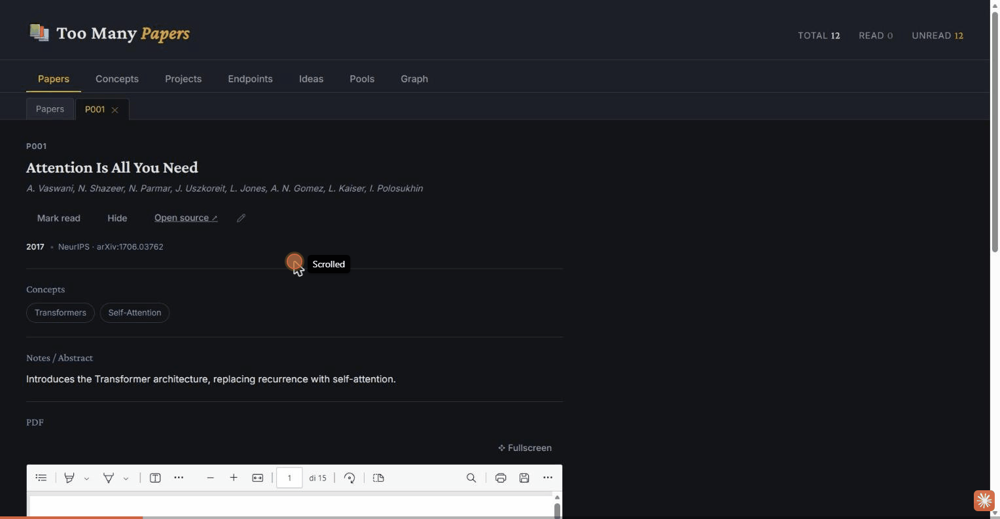

# Too Many Papers

**An LLM-powered knowledge graph for the papers you'll never finish reading.**

A local-first research assistant for Claude. No cloud, no database, no subscriptions. Just JSON files and an MCP server that lets Claude read and write them through validated tools.

```
          ┌─────────────┐
          │  You read a  │
          │    paper     │
          └──────┬───────┘
                 │
                 ▼
   ┌──────────────────────────┐
   │   AI logs the interaction │─────► engagement scores update
   │   links to concepts       │─────► graph grows
   │   flags project relevance │─────► ideas emerge
   └──────────────────────────┘
                 │
                 ▼
   ┌──────────────────────────┐
   │   Next session: AI knows  │
   │   what you care about     │
   │   and what to suggest     │
   └──────────────────────────┘
```

This repository is both the plugin source and a self-hosted **plugin marketplace**, so it installs in one command.

---

## Install

### Claude Code / Claude Desktop

```
/plugin marketplace add FrancescoCorrenti/too-many-papers
/plugin install too-many-papers@too-many-papers
```

That's it. The MCP server, the skill (behavioral rules, onboarding, anti-hallucination protocol, morning briefing), and the Too Many Papers web UI are all installed together.

**Restart Claude after installing** — the MCP server, skill, and `/too-many-papers:webui` command are only loaded on startup.

### Cowork

1. Open the **Customize** tab.
2. Go to **Plugins**.
3. Click **Add** (top right).
4. Choose **Add from repository** and paste the GitHub repo link as the marketplace: `https://github.com/FrancescoCorrenti/TooManyPapers`.
5. Sync, then add the **too-many-papers** plugin.

**Restart Claude after installing** for the plugin to take effect.

### Requirements

- **[uv](https://docs.astral.sh/uv/)** — runs the MCP server. `uv` manages its own Python interpreter and installs dependencies on first run, so there's nothing to `pip install` and no dependency on whatever `python`/`python3` happens to be on your system PATH (this matters especially on Windows, and with conda — `uv` doesn't rely on an activated shell).
  - macOS/Linux: `curl -LsSf https://astral.sh/uv/install.sh | sh`
  - Windows (PowerShell): `powershell -ExecutionPolicy ByPass -c "irm https://astral.sh/uv/install.ps1 | iex"`
- **Node.js 18+** — only needed if you want the Too Many Papers web UI. The MCP server and skill work without it.

---

## What is this?

It has two main interfaces:

1. **Your LLM chat**, where you discuss papers and the AI maintains a knowledge graph of your interests.
2. **Too Many Papers**, a local web app for browsing, searching, and managing your paper collection.

Once installed, run `/too-many-papers:webui` (or just ask the AI to "open Too Many Papers") — it calls the `webui_launch` MCP tool, which starts the server from the files already inside the installed plugin (no separate download, no need to locate the plugin folder yourself) and gives you the link: http://localhost:3737.

A tab per object type (Papers, Concepts, Projects, Endpoints, Ideas, Pools, plus a force-directed Graph view) with closable detail sub-tabs — the list view shows only the essentials, opening an item shows everything (abstract/notes, connections, an inline PDF viewer) without losing your place. Every tab keeps its most-used filters in easy reach (search, status/area, read state, node-type toggles in the Graph view) with an "Advanced filters" panel one click away for deeper queries — a "linked to" cross-reference filter (any paper/concept/project/etc. connected to a chosen node) in the list tabs, and a "linked to concept" BFS filter plus per-edge-type toggles in the Graph view. Also: full-text search, filter by concept/venue/read status, pin favorites to the top, citation network links (click to navigate), a pencil button to edit every field of any paper or graph node in place, dark theme. PDFs are fetched automatically (arXiv, Semantic Scholar, Unpaywall — see below) so the viewer usually has something to show without manual downloading.

<p align="center">
  
</p>

### First run

The AI gives a short self-introduction, then asks a single open question: describe in your own words what you're currently working on (research areas, active projects, anything specific). From that free-text answer, it drafts a proposed set of concepts and projects for the graph and shows it to you for confirmation/edits before creating anything — no multi-step form to fill in field by field. It then asks whether you want a daily briefing.

### The knowledge graph

Everything lives in a typed graph with **nodes** and **edges**, browsable as a force-directed graph in the web UI — click any node to jump straight to its detail tab, hover an edge to see the relationship:

<p align="center">
  
</p>

| Node type | What it represents |
|-----------|-------------------|
| `concept` | A research area you care about |
| `project` | An active research project with goals |
| `endpoint` | A specific milestone within a project |
| `idea` | A concrete idea connected to a project |
| `pool` | A transversal idea that spans projects |

| Edge type | Connects |
|-----------|----------|
| `connected_to` | concept <> concept |
| `uses_concept` | project > concept |
| `part_of` | endpoint/idea > project |
| `inspired_by` | idea > paper |
| `relevant_to` | paper > project |
| `enables` | concept > concept (directional) |
| `derived_from` | any > any |

All types are **hardcoded and validated** by the MCP server. The LLM cannot invent new types.

### Engagement tracking

Every interaction with a concept is logged with a weight:

| Event | Weight |
|-------|--------|
| `read` | 2 |
| `discussed` | 3 |
| `deepened` | 5 |
| `linked` | 8 |
| `paper_requested` | 10 |

Scores decay at **0.7x per week**. `linked` is logged automatically by the server whenever a `relevant_to`/`uses_concept` edge is created — it's a structural fact, not a judgment call. The other four require the AI's read of the conversation (only it can tell that something was "discussed" or "deepened"), so it calls `graph_interact` for those explicitly.

### Audit log and health checks

Every mutation (paper added, edge created, node deleted, etc.) is written automatically to an append-only `_log.jsonl` — a mechanical "what changed, when" record the server produces as a side effect of the tool call, not something the AI has to remember to do separately. `graph_lint` complements this by health-checking the graph on request: orphan nodes with no edges, projects with no papers linked, dangling `cites`/`cited_by` references, papers pointing at a deleted venue, ideas left open and untouched for months, and concepts that have gone quiet. It only reports issues — nothing is fixed or deleted automatically.

### Filtering, everywhere

Every tab keeps the filters you use most (search, status, node type) always visible, with an "Advanced filters" panel one click away for a "linked to" cross-reference filter — pick any concept, project, paper, etc. and instantly see everything connected to it:

<p align="center">
  
</p>

### Automatic PDF fetching

When a paper is added, the server tries to resolve and download an open-access PDF on its own — arXiv first (a known-stable URL pattern, no request needed), then Semantic Scholar's `openAccessPdf`, then Unpaywall's `best_oa_location` (falls through to the next source if an earlier one's link turns out not to be a real PDF). No scraping, no paywall bypass — only these three APIs. Every download is byte-validated (it must actually start with the PDF magic bytes) before being saved, so a redirect or paywall HTML page can never end up masquerading as the paper. If nothing is found, the paper is marked `pdf_status: unavailable` (paywalled, nothing to do) instead of `error: ...` (a source was found but the download failed — worth retrying with `papers_sync_pdfs`). Set `UNPAYWALL_EMAIL` (or reuse `TOO_MANY_PAPERS_CONTACT_EMAIL`) to enable the Unpaywall step — see "Recommended environment variables" in `too-many-papers-plugin/README.md`.

The fetched PDF is viewable inline in the paper's detail tab (with a fullscreen toggle and page-referenced notes saved back into the JSON), and every field is editable in place via the pencil button next to the title:

<p align="center">
  
  <br><br>
  
</p>

### Anti-hallucination

- Every paper must have a `source_verified` URL from a primary source (arXiv, DOI, PubMed, etc.)
- Author lists must be complete and verbatim. "et al." is rejected.
- Connections between papers are marked `[inference]` when not fact-verified.
- The AI cannot invent node types, edge types, or interaction types.
- Paper discovery always goes through `papers_discover` (arXiv, Semantic Scholar, OpenAlex) — never general web search — so every candidate is a real, verifiable API result rather than something scraped or guessed.

---

## Morning Briefing

On first use, the AI offers a daily paper briefing: a curated selection of papers based on your engagement scores, active projects, and pending requests. If your client supports scheduled tasks, it sets one up with a fixed, hardcoded prompt (see the skill's `SKILL.md`) so the routine can't drift or hallucinate over time. Otherwise, just ask "give me today's paper briefing" any time.

---

## Repository layout

```
too-many-papers/                     (this repo = the marketplace)
├── .claude-plugin/
│   └── marketplace.json             # marketplace catalog (lists the plugin below)
├── README.md                        # this file
├── LICENSE
└── too-many-papers-plugin/          # the actual plugin
    ├── .claude-plugin/
    │   └── plugin.json              # plugin manifest
    ├── .mcp.json                    # MCP server registration
    ├── README.md                    # plugin-specific docs
    ├── server/
    │   ├── pyproject.toml
    │   ├── _papers.json             # paper catalog (your data)
    │   ├── _venues.json             # venue catalog (your data)
    │   ├── _graph.json              # knowledge graph (your data)
    │   ├── pdfs/                    # automatically-fetched PDFs (your data)
    │   └── _scripts/
    │       ├── papers_api.py        # core API (CLI + library)
    │       └── mcp_server.py        # MCP server wrapper, exposes 46 tools
    ├── skills/
    │   └── too-many-papers/
    │       ├── SKILL.md             # behavioral rules, onboarding, briefing prompt
    │       └── references/
    │           └── mcp-tools.md     # full tool reference
    ├── commands/
    │   └── webui.md                 # /too-many-papers:webui — launches the web UI
    └── webui/
        ├── paper-library-server.js  # Too Many Papers backend
        ├── paper-library.html       # Too Many Papers frontend
        ├── launch.py                # double-click to start the web UI
        └── launch.bat
```

### Why a marketplace, not just a plugin?

A bare plugin repo can still be installed directly (`/plugin install owner/repo`), but wrapping it in a marketplace gives you versioning, update notifications (`/plugin marketplace update`), and a clean install command that doesn't depend on knowing the exact plugin subpath.

---

## MCP Tools Reference

<details>
<summary><b>Paper tools</b> (17)</summary>

| Tool | Description |
|------|-------------|
| `papers_list` | List all papers |
| `papers_get` | Get full paper card by ID |
| `papers_search` | Fuzzy search on title and authors (local catalog only) |
| `papers_by_concept` | Papers tagged with a concept |
| `papers_by_author` | Papers by author surname |
| `papers_by_venue` | Papers published in a venue |
| `papers_by_year` | Papers by publication year |
| `papers_outside` | Papers outside comfort zone |
| `papers_hidden` | Hidden papers |
| `papers_next_id` | Next available paper ID |
| `papers_discover` | Search arXiv/Semantic Scholar/OpenAlex for new papers, plus citation-based expansion — deduplicated across providers and against the catalog |
| `papers_add` | Add a new paper (with validation) |
| `papers_update` | Update paper fields (merge patch) |
| `papers_check_duplicates` | Check candidates against existing catalog |
| `papers_hide` | Hide a paper from default views |
| `papers_unhide` | Restore a hidden paper |
| `papers_delete` | Permanently delete a paper (scrubs it from other papers' `cites`/`cited_by`) — unlike `papers_hide`, this cannot be undone |

`papers_discover` is the only tool that talks to the outside world to find new papers — the AI is instructed to always use it instead of general web search, so every candidate is a real, verifiable API result, not something scraped or guessed.
</details>

<details>
<summary><b>Graph tools</b> (18)</summary>

| Tool | Description |
|------|-------------|
| `graph_status` | Overview: node/edge/interaction counts |
| `graph_node` | Get a node with all its edges and recent interactions |
| `graph_nodes` | List nodes, optionally filtered by type |
| `graph_add_concept` | Add a concept node (name, area, description?) |
| `graph_add_project` | Add a project node (name, status, description?) |
| `graph_add_endpoint` | Add an endpoint node (name, status, description?) |
| `graph_add_idea` | Add an idea node (name, status, created, description?, source?) |
| `graph_add_pool` | Add a pool node (name, created, description?) |
| `graph_update_node` | Update node fields (rejects unrecognized fields for the node's type) |
| `graph_remove_node` | Remove a node and all its edges |
| `graph_add_edge` | Add a typed edge between nodes — auto-logs a "linked" interaction for relevant_to/uses_concept edges |
| `graph_remove_edge` | Remove edges between nodes |
| `graph_neighbors` | BFS traversal from a node (configurable depth) |
| `graph_path` | Find shortest path between two nodes |
| `graph_interact` | Log a conversational interaction (engagement tracking) — for signals only a human/LLM judgment can detect |
| `graph_engagement` | Compute engagement scores with decay |
| `graph_search` | Full-text search across nodes and papers |
| `graph_lint` | Health-check: orphan nodes, projects with no papers, dangling references, stale ideas, quiet concepts (read-only) |

Each `graph_add_*` tool is typed per node type — its MCP schema only exposes that type's real fields, so a field that isn't part of the schema (e.g. a made-up "goal") can't be passed at all, rather than being silently accepted or invented.
</details>

<details>
<summary><b>Citation tools</b> (3)</summary>

| Tool | Description |
|------|-------------|
| `citations_get` | Fetch real citations from Semantic Scholar (read-only) |
| `citations_apply` | Fetch and save citation links to paper |
| `citations_sync` | Sync citations for all papers |
</details>

<details>
<summary><b>PDF tools</b> (2)</summary>

| Tool | Description |
|------|-------------|
| `papers_fetch_pdf` | Resolve and download an open-access PDF for one paper (arXiv, then Semantic Scholar, then Unpaywall — no scraping, no paywall bypass) |
| `papers_sync_pdfs` | Run `papers_fetch_pdf` for every paper that doesn't already have a PDF on disk |

Every URL is either a known-stable pattern (arXiv) or comes from a real API response reporting an open-access location — nothing is guessed, and downloads are byte-validated (must actually look like a PDF) before being saved.
</details>

<details>
<summary><b>Venue tools</b> (5)</summary>

| Tool | Description |
|------|-------------|
| `venues_list` | List all venues |
| `venues_get` | Get venue details |
| `venues_add` | Add a new venue |
| `venues_update` | Update venue fields |
| `venues_delete` | Permanently delete a venue — refuses if papers still reference it unless forced. Cannot be undone. |
</details>

---

## FAQ

**Do I need Claude specifically?**
The system is designed for Claude and tested with Claude Code / Claude Desktop / Cowork. Any MCP-compatible client will work, but you'll need to load `skills/too-many-papers/SKILL.md` manually or adapt it to your client's conventions.

**Where is my data stored?**
Inside the installed plugin directory: `too-many-papers-plugin/server/_papers.json`, `_venues.json`, `_graph.json`, plus an append-only `_log.jsonl` audit trail and a `pdfs/` folder for automatically-fetched PDFs. Plain JSON, version-controllable, portable.

**Can I use this without an LLM?**
Yes. `papers_api.py` works as a standalone CLI, and the Too Many Papers web UI works independently.

**How do I back up?**
It's just files. Copy `too-many-papers-plugin/server/` (inside your plugin install directory, typically under `~/.claude/plugins/cache/...`) or fork this repo and commit your own data.

**Can the AI modify my files directly?**
No. The skill instructs the AI to use MCP tools only. The tools validate everything: the AI cannot invent new node types, edge types, or bypass anti-hallucination checks.

**How do I update?**
Run `/plugin marketplace update` then `/plugin update too-many-papers@too-many-papers`.

---

## License

MIT
