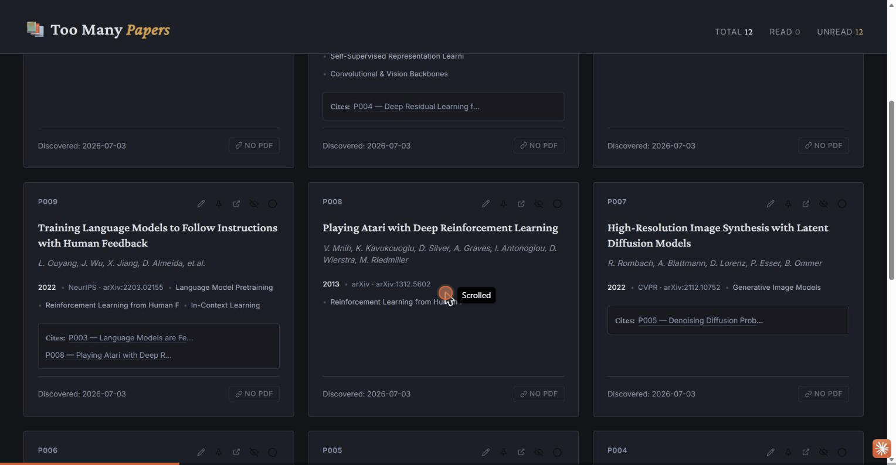
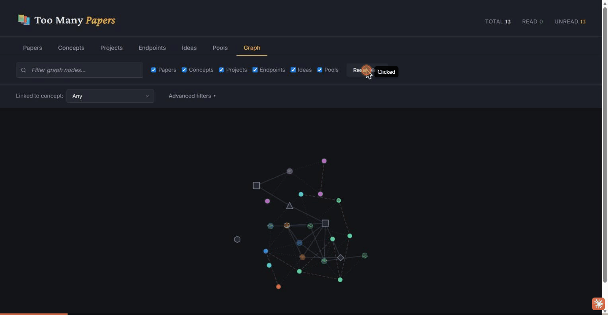
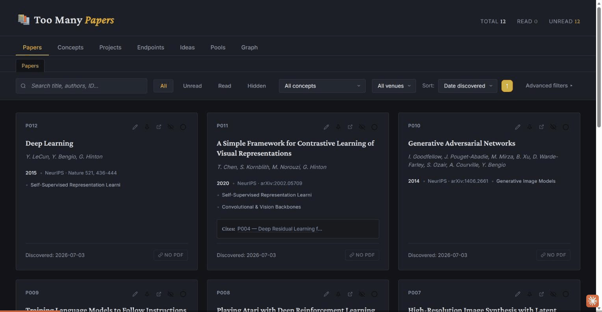
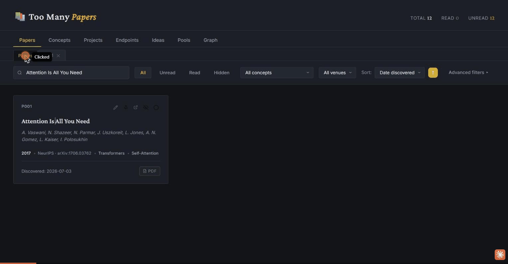

# Too Many Papers

**An LLM-powered knowledge graph for the papers you'll never finish reading.**

A local-first research assistant. No cloud, no database, no subscriptions — just JSON files and an MCP server that lets Claude read and write them through validated tools.

## Components

| Component | What it does |
|-----------|--------------|
| **Skill** (`skills/too-many-papers`) | Behavioral rules, onboarding flow, anti-hallucination protocol, and the hardcoded morning-briefing prompt. Loads automatically when you talk about papers, research concepts, or ask for a briefing. |
| **MCP server** (`server/`) | 46 tools (`papers_*`, `venues_*`, `graph_*`, `citations_*`) backed by `papers_api.py`. Includes automatic PDF fetching (`papers_fetch_pdf`, `papers_sync_pdfs`) from arXiv, Semantic Scholar, and Unpaywall — no scraping, no paywall bypass. All reads/writes to `_papers.json`, `_venues.json`, `_graph.json` go through here — each tool's parameters are typed per node/edge type, so the LLM can't invent fields, node/edge/interaction types, or bypass validation. `papers_discover` queries arXiv, Semantic Scholar, and OpenAlex directly, so paper discovery never depends on general web search. Everything is deletable: `papers_delete`, `venues_delete`, and `graph_remove_node`/`graph_remove_edge` cover papers, venues, and graph nodes/edges respectively — all require confirmation and cannot be undone. Every mutation is also recorded automatically in an append-only `_log.jsonl` audit trail, and `graph_lint` health-checks the graph for orphaned nodes, dangling references, and stale ideas. |
| **Too Many Papers web UI** (`webui/`) | Local browser app with a tab per object type (Papers, Concepts, Projects, Endpoints, Ideas, Pools) plus a force-directed Graph view, closable detail sub-tabs, pinning, citation network links, and an inline PDF viewer. Each tab keeps common filters (search, status/area, read state, graph node-type toggles) in easy reach, with an "Advanced filters" panel for a cross-reference "linked to" filter and, in the Graph view, a "linked to concept" BFS filter with per-edge-type toggles. Every field of every paper or graph node is editable in place via a pencil button. Shares the same data files as the MCP server. |

  
  &nbsp;
  

## Setup

Requires **[uv](https://docs.astral.sh/uv/)**. The server runs via `uv run`, which provisions its own Python interpreter and installs dependencies (`mcp`) on first launch — nothing to `pip install` by hand, and no dependency on a system `python`/`python3` being on PATH.

- macOS/Linux: `curl -LsSf https://astral.sh/uv/install.sh | sh`
- Windows: `powershell -ExecutionPolicy ByPass -c "irm https://astral.sh/uv/install.ps1 | iex"`

(Node.js 18+ is only needed if you want the web UI.)

Once installed via Cowork / Claude Code, the MCP server starts automatically — no manual `claude mcp add` step needed.

### Recommended environment variables (paper discovery & citations)

`papers_discover` and the citation tools work without any of these — arXiv never needs a key, and Semantic Scholar/OpenAlex fall back to slow, heavily-throttled anonymous requests. But **OpenAlex changed its pricing in 2026: anonymous search now has a near-zero daily budget**, so without a key you'll hit rate limits quickly. Both keys below are free:

| Variable | Effect | Get one at |
|----------|--------|------------|
| `S2_API_KEY` | Semantic Scholar API key — much higher rate limit for search + citations (anonymous falls back to ~1 request/3.5s). | [semanticscholar.org/product/api](https://www.semanticscholar.org/product/api#api-key-form) |
| `OPENALEX_API_KEY` | OpenAlex API key — required in practice for reliable search since their 2026 pricing change; $1/day free usage, plenty for personal use. | [openalex.org/settings/api](https://openalex.org/settings/api) |
| `TOO_MANY_PAPERS_CONTACT_EMAIL` | Used only if `OPENALEX_API_KEY` isn't set, as OpenAlex's "polite pool" contact. Also used by `UNPAYWALL_EMAIL` below if that isn't set. | — |
| `UNPAYWALL_EMAIL` | Contact email for Unpaywall (used by automatic PDF fetching); no key/signup needed, just any working email. Falls back to `TOO_MANY_PAPERS_CONTACT_EMAIL` if unset. | [unpaywall.org/products/api](https://unpaywall.org/products/api) |
| `ARXIV_MIN_INTERVAL`, `OPENALEX_MIN_INTERVAL`, `S2_MIN_INTERVAL` | Minimum seconds between requests to each provider, if you want to tune throttling manually. Default automatically slower when no key is set. |

If discovery keeps failing with rate-limit errors, the AI should tell you to set these — see the error message from `papers_discover`, which spells out exactly which key is missing and where to get it.

## Usage

Just talk about papers. On first use, the skill gives a brief self-introduction, then asks a single open question — describe what you're currently working on — and drafts a proposed set of concepts/projects from your answer for you to confirm or edit, followed by an optional daily briefing schedule.

Examples:
- "I just read this paper: [link] — add it to my library"
- "What should I read next on segmentation?"
- "Give me today's paper briefing"
- "Connect this paper to my FCD project"

To open the visual library, run `/too-many-papers:webui`, or just ask to open Too Many Papers. This calls the `webui_launch` MCP tool and gives you the link (http://localhost:3737) — no manual script to find or run.

  
  &nbsp;
  

## Data

Everything lives in `server/_papers.json`, `server/_venues.json`, `server/_graph.json`, plus an append-only `server/_log.jsonl` audit trail of every mutation (written automatically by the server, not something the AI has to remember to update). Automatically-fetched PDFs are saved under `server/pdfs/`. Plain JSON, version-controllable, portable. Back up by copying the `server/` folder or committing it to git.

## License

MIT
